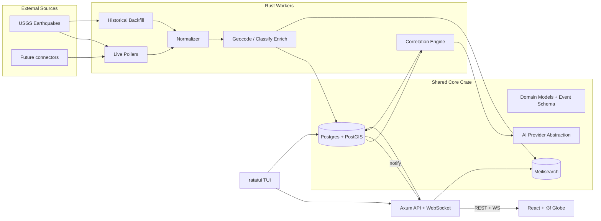

# Geos - OSINT Event Intelligence Globe

## 1. Product summary
A multi-tenant SaaS that ingests public/OSINT data, normalizes it into a single canonical event format, stores it in PostgreSQL + PostGIS, draws AI/algorithmic connections between related events, and renders everything on an interactive 3D globe with sidebars, fuzzy search, and filters.

Confirmed decisions:
- Frontend: React + Vite + TypeScript + Tailwind + shadcn/ui; globe via react-three-fiber (Three.js) + custom WebGL shaders.
- Backend/workers/CLI: Rust (Axum API, Tokio workers, ratatui TUI). Cargo workspace.
- DB: PostgreSQL + PostGIS. Search: Meilisearch. Infra: Docker Compose. Package manager: pnpm.
- Ingestion: Rust workers — live pollers + historical backfill; updates pushed to UI via WebSocket.
- AI: configurable multi-provider abstraction (Anthropic / OpenAI / Ollama).
- SaaS: multi-tenant from day one; self-built JWT + argon2 auth with org/workspace tables; plan/quota model now, Stripe integrated later.
- First connector: USGS earthquakes, built on an extensible connector trait.

## 2. Architecture

## 3. Repository layout
Cargo workspace at root + pnpm-managed frontend.

- `Cargo.toml` (workspace) with members below
- `crates/core/` - domain models, canonical `Event` schema, DB access (SQLx), PostGIS helpers, AI provider trait, config, error types
- `crates/api/` - Axum HTTP + WebSocket API (`/api/v1`), auth, tenant scoping
- `crates/workers/` - connectors, pollers, backfill, normalizer, enrichment, correlation engine
- `crates/cli/` - ratatui interactive TUI (lazygit/btop-style)
- `migrations/` - SQLx migrations (PostGIS-enabled)
- `frontend/` - React + Vite + Tailwind + shadcn/ui + react-three-fiber
- `nebular-os/` - git submodule (read-only vendor) -> S3-compatible object storage for media ([github.com/AsP3X/nebular-os](https://github.com/AsP3X/nebular-os)); never edited in this repo (see `nebular-os-vendor.mdc`)
- `scripts/` - dev helpers (db up/reset/seed, dev-all, lint, gen types, submodule init, nebular export-patch)
- `docker-compose.yml` - postgres+postgis(+pgvector), meilisearch, object-storage (built from ./nebular-os), api, workers, frontend
- `.cursor/rules/` - copied rule set (Section 9)
- `LICENSE` - Nebular OS Private Non-Commercial License v1.0 (Copyright Niklas Vorberg)
- `README.md`

## 4. Canonical event format (single source of truth)
Defined once in `crates/core/` (Rust structs) and mirrored as a JSON schema for the frontend/CLI.

Core `events` table fields:
- `id` (uuid), `tenant_id` (uuid), `source` (text), `source_event_id` (text, unique per source+tenant)
- `category` (enum: earthquake, incident, alert, weather, news, conflict, wildfire, other)
- `severity` (enum: info, low, moderate, high, critical) and `magnitude` (float, nullable — e.g. quake M)
- `title`, `summary`, `body` (text)
- `location` (PostGIS `geography(Point,4326)`), `affected_area` (`geometry(Polygon,4326)`, nullable)
- `country`, `region`, `place_name`
- `occurred_at`, `detected_at`, `ingested_at` (timestamptz)
- `status` (active/resolved/archived), `confidence` (float), `tags` (text[])
- `raw` (jsonb — original payload), `url` (source link)
- Indexes: GiST on `location`/`affected_area`, btree on `occurred_at`, `category`, `tenant_id`; trigram/Meilisearch for text.

Supporting tables: `event_relations` (from_event, to_event, relation_type, score, method [ai|rule|geo|temporal], rationale), `sources`, `connectors_state` (cursor/last_run for backfill), `tenants`, `users`, `memberships`, `api_keys`, `audit_log`.

## 5. Ingestion (Rust workers)
- `Connector` trait: `fetch_live()` and `fetch_historical(range)` returning raw records; first impl `UsgsEarthquakeConnector` (GeoJSON feed + historical query API).
- Pipeline: connector -> raw normalize into canonical `Event` -> enrichment (reverse geocode country/region, category/severity mapping) -> upsert (dedupe on source+source_event_id) -> index in Meilisearch -> emit DB `NOTIFY` for live WS push.
- Scheduler: Tokio-based interval pollers per connector + a separate backfill task that walks historical windows using `connectors_state` cursors, rate-limited.
- All workers tenant-aware (system/global tenant for shared public feeds; design allows per-tenant private sources later).

## 6. Correlation / connection engine
- Stage 1 deterministic (fast, in `workers`): geo-temporal clustering using PostGIS (`ST_DWithin`) + time windows + tag/category overlap -> candidate relation edges.
- Stage 2 AI (multi-provider trait in `core`): batch candidate clusters to the configured LLM to label relation type, score confidence, and write a short rationale; results stored in `event_relations`.
- Provider abstraction: `AiProvider` trait with Anthropic/OpenAI/Ollama impls, selected via config; prompts/versioning kept in `core`.

## 7. Backend API (Axum)
- `/api/v1` REST: auth (register/login/refresh), tenants/memberships, events (list/filter/bbox/get), relations, sources, search proxy (Meilisearch), saved filters.
- Geospatial queries: viewport bbox + category/severity/time filters via PostGIS.
- WebSocket `/api/v1/stream`: pushes new/updated events to subscribed clients (tenant-scoped).
- Auth: JWT access/refresh, argon2 password hashing, tenant scoping middleware, API keys for CLI/automation. Audit logging on mutations.

## 8. Frontend (React + react-three-fiber)
- Globe: r3f scene, earth with custom shaders (atmosphere/glow), event markers positioned by lat/lon (clustered at low zoom), color/shape by category & severity, animated arcs for `event_relations`.
- Layout: left selector sidebar (sources/categories/layers), top global fuzzy search bar (Meilisearch-backed), right toggleable filter sidebar; sidebars are blurred/transparent (backdrop-blur) per the desired theme.
- Data: REST for initial/viewport load + WebSocket for live updates; detail panel on marker click showing event + connected events.
- Stack: Vite, TypeScript, Tailwind, shadcn/ui, zustand/react-query for state.

## 9. Cursor rules to copy (then adjust for Geos)
Copy these files into `geos/.cursor/rules/` in full, then adapt wording to Geos. Where the same rule exists in multiple repos, take the most complete version and merge (notably `git-commits.mdc`: cloudwrkz is the largest). De-duplicate overlaps; keep one canonical copy per rule plus project-specific ones.

From `[ownly/.cursor/rules](../ownly/.cursor/rules)`:
- [agent.mdc](../ownly/.cursor/rules/agent.mdc)
- [api-error-shape.mdc](../ownly/.cursor/rules/api-error-shape.mdc)
- [api-sqlx-migrations.mdc](../ownly/.cursor/rules/api-sqlx-migrations.mdc)
- [audit-log-coverage.mdc](../ownly/.cursor/rules/audit-log-coverage.mdc)
- [data-safety.mdc](../ownly/.cursor/rules/data-safety.mdc)
- [docker-compose-safety.mdc](../ownly/.cursor/rules/docker-compose-safety.mdc)
- [frontend-npm-lockfile-docker.mdc](../ownly/.cursor/rules/frontend-npm-lockfile-docker.mdc)
- [git-commits.mdc](../ownly/.cursor/rules/git-commits.mdc)
- [inline-documentation.mdc](../ownly/.cursor/rules/inline-documentation.mdc)
- [nebular-os-vendor.mdc](../ownly/.cursor/rules/nebular-os-vendor.mdc)
- [plan-execution.mdc](../ownly/.cursor/rules/plan-execution.mdc)
- [regression-testing.mdc](../ownly/.cursor/rules/regression-testing.mdc)
- [security-audit-scripts.mdc](../ownly/.cursor/rules/security-audit-scripts.mdc)
- [rust/no-allow-dead-code.mdc](../ownly/.cursor/rules/rust/no-allow-dead-code.mdc)

From `[cloudwrkz/.cursor/rules](../cloudwrkz/.cursor/rules)`:
- [agent.mdc](../cloudwrkz/.cursor/rules/agent.mdc)
- [api-error-shape.mdc](../cloudwrkz/.cursor/rules/api-error-shape.mdc)
- [api-sqlx-migrations.mdc](../cloudwrkz/.cursor/rules/api-sqlx-migrations.mdc)
- [apps-web-deprecated.mdc](../cloudwrkz/.cursor/rules/apps-web-deprecated.mdc)
- [audit-log-coverage.mdc](../cloudwrkz/.cursor/rules/audit-log-coverage.mdc)
- [data-safety.mdc](../cloudwrkz/.cursor/rules/data-safety.mdc)
- [docker-compose-safety.mdc](../cloudwrkz/.cursor/rules/docker-compose-safety.mdc)
- [git-commits.mdc](../cloudwrkz/.cursor/rules/git-commits.mdc)
- [inline-documentation.mdc](../cloudwrkz/.cursor/rules/inline-documentation.mdc)
- [plan-execution.mdc](../cloudwrkz/.cursor/rules/plan-execution.mdc)
- [regression-testing.mdc](../cloudwrkz/.cursor/rules/regression-testing.mdc)
- [rust/no-allow-dead-code.mdc](../cloudwrkz/.cursor/rules/rust/no-allow-dead-code.mdc)

From `[aurora/.cursor/rules](../aurora/.cursor/rules)`:
- [agent.mdc](../aurora/.cursor/rules/agent.mdc)
- [api-error-shape.mdc](../aurora/.cursor/rules/api-error-shape.mdc)
- [git-commits.mdc](../aurora/.cursor/rules/git-commits.mdc)
- [inline-documentation.mdc](../aurora/.cursor/rules/inline-documentation.mdc)
- [plan-execution.mdc](../aurora/.cursor/rules/plan-execution.mdc)
- [project-layout.mdc](../aurora/.cursor/rules/project-layout.mdc) (use as template for a new Geos `project-layout.mdc`)
- [rust/no-allow-dead-code.mdc](../aurora/.cursor/rules/rust/no-allow-dead-code.mdc)

## 10. Dev scripts (`scripts/`)
- `dev.sh` (run api + workers + frontend), `db.sh` (up/reset/migrate/seed), `seed.sh` (load sample USGS events), `lint.sh` (cargo clippy/fmt + eslint), `gen-types.sh` (export event JSON schema -> TS types).

## 11. Suggested build order
Scaffold workspace + Docker + rules -> core crate + canonical schema + migrations -> USGS connector + worker pipeline -> API + auth + geo queries + WS -> frontend globe + sidebars + search -> correlation engine (geo/temporal then AI) -> CLI TUI -> polish/tests.

## 12. Additional scope decisions (confirmed)

- Globe style: stylized dark "command-center" globe — custom shader earth + glowing atmosphere + subtle country borders rendered from offline Natural Earth data. No external photoreal/satellite tiles in v1 (offline, no tile costs); an optional imagery layer can be added later.
- Reverse geocoding + local reference data lake: use an offline dataset (Natural Earth / GADM polygons in PostGIS) for country/region/place lookup during enrichment. Additionally, build a local reference-data cache/mirror that progressively grows: when we query external geodata sources (OpenStreetMap/Nominatim and others), store the fetched results locally so over time Geos owns an increasingly complete offline geodata corpus and reduces external dependence. Schema: `geo_reference` (cached places/boundaries with source, fetched_at, geometry) + a fetch-and-store enrichment step.
- Backfill & retention: backfill ~1 year per connector initially and keep all data, with these values exposed as editable settings (per-tenant/per-connector) so depth and retention can be changed later in the UI. Stored in `connectors_state` / tenant settings.
- RBAC: ship three default role presets — Owner (billing + members), Analyst (edit/annotate), Viewer (read-only) — built on top of a granular permission system, so custom roles with fine-grained permissions can be defined later. Schema: `roles`, `permissions`, `role_permissions`, `memberships.role_id`; presets seeded on tenant creation.
- Notifications: deferred — not built in v1, added later. Keep `saved_filters` (used for filtering/exports now), and leave room in the design for in-app/email/webhook (Slack/Discord/generic) delivery to be added later without schema rewrites.
- Cross-source entity resolution: merge events matching on geo + time + text similarity into a canonical event holding multiple source references (dedupe within and across sources). Implemented alongside the correlation engine.
- Observability: structured logging via `tracing`, Prometheus metrics endpoint, OpenTelemetry traces, and Sentry (or equivalent) error tracking — included from the start.
- Extra capabilities (all in scope for v1 planning):
  - Data export: GeoJSON + CSV export endpoints and basic report generation.
  - Annotations / verification workflow: confirm, flag false-positive, add notes; per-event annotation history (audit-logged). Schema: `event_annotations`, `event_status` transitions.
  - Air-gapped / offline deployment: core features (ingest of locally-mirrored data, globe, search, correlation via local Ollama, geocoding via offline dataset) must run with no outbound internet. External connectors and cloud AI become optional/disabled in air-gapped mode.
  - Media handling: store/display images & video attached to events; object-storage refs in schema with thumbnails; in-app viewer in the event detail panel. Storage backend is nebular-os (self-hosted S3-compatible), vendored as a read-only git submodule and run as the `object-storage` service in Docker Compose; integration (JWT/signing alignment, upload limits, HTTP client) lives in Geos `crates/core` storage module, never in the submodule.
  - Timeline / time-scrubber: replay events over time on the globe (play/pause, speed, time-window brushing).
  - CI from the start: pipeline for lint (clippy/fmt, eslint), tests (Rust + frontend), and build; automated tests written alongside features.

## 13. Refinements (confirmed)

- Semantic layer (pgvector): add the `pgvector` Postgres extension and embedding columns for events (and entities). Embeddings power natural-language search, stronger cross-source dedupe, and "find related events" beyond geo/time. Embeddings generated via the AI provider abstraction, with a local Ollama embedding model option so this works air-gapped. Hybrid search = Meilisearch (keyword/fuzzy) + pgvector (semantic).
- AI enrichment roles (in addition to correlation): during ingestion the AI pipeline will (1) auto-generate concise event summaries, (2) translate foreign-language source text into the user's language (store original + translation), (3) classify/normalize category & severity when the source is ambiguous, and (4) extract entities (people, orgs, places, weapons, etc.). Entities stored in `entities` + `event_entities` join for filtering and future relationship graphing. All AI steps run through the multi-provider abstraction and are skippable in air-gapped/minimal mode.
- Auth scope (self-built, v1):
  - Email/password login (argon2) + JWT access/refresh.
  - Password reset flow: included.
  - MFA (TOTP authenticator app): must be supported in v1.
  - Email verification: schema + flow built but optional/disabled by default for now (no SMTP server yet); a config flag turns it on once an email server is available. Same SMTP layer will later serve email notifications.
  - OAuth/SSO: deferred.
- View modes: 3D globe is primary, with a density/heatmap layer toggle. (No flat 2D map in v1.)
- Connector roadmap: USGS earthquakes first (v1), then Weather alerts (NOAA/OpenWeather) as the next connector. Others (GDELT, FIRMS, ACLED, news/RSS, social) follow later on the same `Connector` trait.
- Production + storage: single-server Docker Compose for prod; media via self-hosted nebular-os object storage (S3-compatible), kept cloud/S3-portable. Kubernetes can come later without app changes.
- UI: desktop-first, dark theme only (command-center aesthetic). Responsive/light themes deferred.
- License: Nebular OS Private Non-Commercial License v1.0 (Copyright (c) 2026 Niklas Vorberg) — source-available, non-commercial for third parties; as copyright holder you retain full rights to commercialize/sell Geos. Ship the `LICENSE` file at repo root.

## 14. Further refinements (confirmed)

- Unified impact scoring: every event gets a normalized `impact_score` (0-100) derived from category, magnitude, casualties/affected count, affected area, and source confidence, plus a coarse `severity` tier (info -> critical). This lets a single slider in the filter sidebar compare a started war against a burst water pipe. Scoring logic lives in `crates/core` (deterministic, versioned) and is recomputed on enrichment; weights are configurable.
- Source trust + verification: `sources` carries a reliability rating; each event carries a `verification_status` (verified / unverified / rumor / disputed) alongside the numeric `confidence`. Both are displayed on the globe/detail panel and are filterable. Verification status is updatable via the annotation/verification workflow and audit-logged.
- Scale / partitioning: the `events` table is time-partitioned (monthly partitions) from the start, with retention/archival routines, so high ingestion volume does not force a painful later migration. Spatial + vector + time indexes are defined per partition strategy.
- Relationship graph view: in addition to globe relation arcs, ship an interactive node-link graph view (events + entities as nodes, relations as edges) for investigating connections. Backed by the relations/entities API; filterable and cross-linked with the globe selection.
- Operator (super-admin) console: a minimal operator area (separate from tenant UI) for you as the SaaS operator to manage tenants, connectors (enable/disable, backfill, health), system health/metrics, usage, and customer API keys/quotas. Guarded by a platform-level super-admin role distinct from tenant RBAC.
- Public/customer API: a documented REST API with OpenAPI spec, per-tenant API keys, and per-tenant rate limiting + quotas (tied to the plan model). API key + quota management is exposed both to tenants and in the operator admin console.
- i18n: English UI for v1, but built on an i18n framework (e.g. i18next) so additional languages can be added without refactoring. (Distinct from AI translation of event content.)
- Operational hardening (in scope): automated DB backup/restore scripts; structured secrets/config management (.env with validation, ready to swap to a vault); global rate limiting + basic abuse protection; end-to-end frontend tests (Playwright); and a command palette / keyboard-driven UX in the frontend for a power-user feel consistent with the command-center aesthetic.

## 15. Final product details (confirmed)

- Plan tiers: Free / Pro / Enterprise, with quotas on seats, enabled connectors, API calls, data retention, and AI usage. Modeled now (`plans`, `tenant_plan`, `quota_usage`); Stripe wired later.
- Areas of Interest (AOI) / geofencing: tenants define watch regions (countries or custom polygons) stored as PostGIS geometry; used for filtering and "my regions" views in v1, and as the trigger source for alerting when notifications land later. Schema: `areas_of_interest` (tenant_id, name, geom, filters).
- Manual / custom events: analysts can create events manually via UI + CLI as a first-class `manual` source, rendered on the globe alongside ingested data, fully participating in correlation, search, export, and verification.
- Per-tenant AI controls: token/cost budgets per tenant with enforcement, plus response caching and request batching to control spend. Usage metered into `quota_usage` and surfaced in the operator console.
- Privacy / compliance (EU GDPR): bake in foundations and follow EU data protection rules. Includes per-tenant data export and deletion (right to access / erasure), PII tagging on events/entities, configurable retention, lawful-basis/consent notes for sources, data-processing/audit trail, and EU-region data residency as a deployment option. Especially relevant once social/PII-bearing sources are added.
- Branding/theme: product name "Geos"; amber/orange accent on near-black (tactical/alert command-center palette). Drives Tailwind theme tokens and globe color accents.