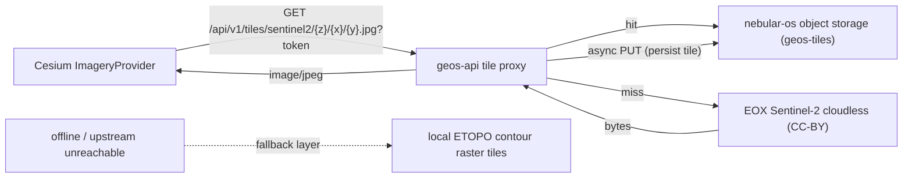

# Google-Earth-style local imagery: Cesium globe + Sentinel-2 caching tile proxy — design

Date: 2026-06-23
Status: Approved (defaults confirmed by user; awaiting execution)
Area: `crates/core` (object-storage client, config), `crates/api` (tile proxy + tiles-session token), `frontend/` (CesiumJS globe replacing react-three-fiber), `scripts/` (offline contour-tile generation), `docs/` (ADR/README)

## 1. Overview

The current globe renders a single fixed `5400x2700` Blue Marble texture stretched over the
whole sphere (`frontend/src/components/globe/GlobeEarth.tsx`). At the equator that is only
~7 km/pixel, so it blurs heavily on zoom and the custom react-three-fiber (r3f) LOD/cluster
code still lags when zooming and rotating.

This work replaces the r3f globe with **CesiumJS**, fed by a **local Sentinel-2 tile pyramid**.
A new `geos-api` **caching tile proxy** serves tiles from the nebular-os object store; on a
cache miss it fetches the tile once from the free EOX Sentinel-2 cloudless service (CC-BY) and
persists it, so we organically build our own local tile dataset. Cesium's native quadtree LOD
provides sharp, smooth zoom to z12 and removes the hand-rolled LOD/culling code. When upstream
imagery is unavailable, the globe falls back to a locally-stored **elevation-contour raster
basemap** generated offline from a public-domain DEM. All current globe features are preserved.

## 2. Goals / non-goals

### Goals
- Google-Earth-style sharp, smooth zoom to ~z12 (~38 m/px) using free, fully-local imagery.
- Caching tile proxy that lazily backfills from EOX and persists tiles to nebular-os object storage.
- Replace the r3f globe with Cesium while preserving every existing feature (dots, clustering,
  selection + detail hydration, cluster-to-sidebar, heatmap, vector overlays, layer toggles,
  status overlay, live WebSocket updates, deep-zoom camera, clear-on-empty-click).
- Offline fallback to a locally-stored elevation-contour raster basemap (no network needed).
- Respect EOX CC-BY licensing with a visible attribution credit.

### Non-goals
- Imagery sharper than Sentinel-2 native (~10 m). True street-level (z14+) is not available from
  free global sources and is out of scope.
- Bulk pre-download of the whole globe at high zoom (multi-TB). Only viewed tiles are cached.
- 3D terrain / elevation mesh (ellipsoid surface only in v1; terrain is a future additive option).
- Tenant-scoping of imagery tiles (imagery is global, not tenant data).

## 3. Resolved decisions

| Topic | Decision |
|---|---|
| Rendering engine | Full switch to CesiumJS (resium React bindings + `vite-plugin-cesium`) |
| Imagery source | EOX Sentinel-2 cloudless (CC-BY 4.0), JPEG tiles |
| Max zoom | z12 (~38 m/px), enforced server-side and as Cesium `maximumLevel` |
| Coverage | Global, lazily cached (only viewed tiles stored) |
| Tile cache backend | nebular-os object storage (bucket `geos-tiles`) |
| Backfill model | Caching proxy: storage hit -> serve; miss -> fetch EOX, serve, async persist |
| Tile auth | Dedicated medium-lived signed "tiles token" via `GET /api/v1/tiles/session` |
| Offline fallback | Elevation-contour raster tiles (z8) from ETOPO 2022 (public domain), GDAL-generated |
| Cutover | Cesium behind a flag until parity, then a single swap removing the r3f globe |
| Attribution | Visible EOX credit on the Cesium credit container |

## 4. Architecture

### Tile request flow

### Frontend swap boundary

The clean seam is the `GlobeViewport` prop contract in
`frontend/src/components/globe/GlobeViewport.tsx`
(`events, selectedId, onSelect, onSelectCluster, onClearSelection, layers, globeTotal,
globeLoading, globeLoadingMore, globeEpoch`). The new Cesium viewport implements the identical
interface so `frontend/src/pages/CommandCenterPage.tsx` is unchanged except the lazy import.

## 5. Backend

### 5.1 Object-storage client (`crates/core`) — currently missing

Only `storage_url` exists today in `crates/core/src/config.rs`; there is no `storage` module.

- New `crates/core/src/storage/mod.rs`: `StorageClient` mirroring `MeiliClient`
  (`crates/core/src/meili/mod.rs`), wrapping a `reqwest::Client`.
  - `get_object(bucket, key) -> Result<Option<Bytes>>`
  - `head_object(bucket, key) -> Result<bool>`
  - `put_object(bucket, key, content_type, bytes) -> Result<()>`
  - Targets nebular-os `GET/HEAD/PUT /{bucket}/{*key}` (`nebular-os/src/server.rs`), authenticated
    with a Geos-minted NOS JWT signed with `NOS_JWT_SECRET` (claims `{sub,email,role,exp,iat}`
    per `nebular-os/src/auth.rs`). Per `nebular-os-vendor.mdc`, integration lives in Geos only.
- Config additions in `crates/core/src/config.rs`: `nos_jwt_secret`, `tiles_bucket`
  (default `geos-tiles`), `imagery_upstream_url` (EOX WMTS template), `tiles_max_zoom`
  (default `12`). Document in `.env.example` and the `api` service env in `docker-compose.yml`.
- Add `reqwest` (root workspace dep) to `crates/core/Cargo.toml`.

### 5.2 Tile proxy endpoint (`crates/api`)

- Extend `AppState` (`crates/api/src/state.rs`) with `reqwest::Client` + `StorageClient`,
  constructed in `crates/api/src/main.rs` (same pattern as `MeiliClient`).
- New `crates/api/src/routes/tiles.rs`, wired in `crates/api/src/app.rs`:
  - `GET /api/v1/tiles/session` (protected): returns a medium-lived signed tiles token
    (audience `tiles`, ~12h) so Cesium's long-lived imagery URL is decoupled from access-token
    rotation.
  - `GET /api/v1/tiles/sentinel2/{z}/{x}/{y}.jpg` (public router; validates `?token=` in-handler
    like `crates/api/src/routes/stream.rs`): bounds-check `z <= tiles_max_zoom`; key
    `sentinel2/{z}/{x}/{y}.jpg`; storage hit -> return bytes; miss -> fetch EOX, return bytes,
    async `put_object`; single-flight de-dupe map to avoid stampedes. Returns a raw
    `axum::response::Response` with `Content-Type: image/jpeg` and a long `Cache-Control`
    (nebular-os `get_object` is the bytes-response reference).
- Tests `crates/api/tests/tiles_api.rs` (copy `events_api.rs` setup): 401 without token,
  200 + `image/jpeg` via `BodyExt::to_bytes`, z>max rejected. Storage/upstream behind a trait so
  tests can stub without network.

## 6. Frontend (CesiumJS)

### 6.1 Scaffolding (behind a flag)
- Deps: `cesium`, `resium`, `vite-plugin-cesium` (sets `CESIUM_BASE_URL` and copies
  Workers/Assets/Widgets; `frontend/vite.config.ts` has no asset-copy config today).
- New `frontend/src/components/globe/cesium/CesiumGlobeViewport.tsx` implementing the same props
  as `GlobeViewport.tsx`. Imagery via `UrlTemplateImageryProvider` ->
  `/api/v1/tiles/sentinel2/{z}/{x}/{y}.jpg?token={tilesToken}` (token from `/tiles/session`,
  refreshed before expiry), `maximumLevel = 12`. Built-in `skyAtmosphere`/`skyBox`/stars;
  `ScreenSpaceCameraController` min/max distance for deep zoom; EOX attribution credit.
- A flag in `frontend/src/pages/CommandCenterPage.tsx` selects the Cesium vs r3f viewport so the
  new globe can reach parity without breaking the app.

### 6.2 Port event layers (preserve all contracts)
- Dots: `PointPrimitiveCollection` with `pixelSize` + `scaleByDistance`; color from
  `frontend/src/components/globe/severity-colors.ts`. Depth-buffer occlusion (drop manual horizon cull).
- Clustering: reuse the camera-distance level pick from
  `frontend/src/components/globe/useScreenClusters.ts` feeding points + a count `LabelCollection`
  (or Cesium built-in `EntityCluster`). Cluster click -> `camera.flyTo` + `onSelectCluster(members)`
  into the existing sidebar (`handleSelectCluster` in `CommandCenterPage.tsx`).
- Selection: highlighted point/billboard + existing `getEvent` hydration; empty pick
  (`ScreenSpaceEventHandler` LEFT_CLICK miss) -> `onClearSelection`.
- Heat: render the `QuakeHeatLayer.tsx` canvas as a `SingleTileImageryProvider`/material overlay;
  keep `globeEpoch` remount + debounce.
- Vector overlays: country borders/coastlines from existing `/geo/ne_*` GeoJSON via
  `GeoJsonDataSource` or polylines, LOD by camera height.
- Layer toggles (`quakeDots/quakeHeat/weather`), status overlay, and live WebSocket upserts into
  `globeEvents` are unchanged at the page level.

### 6.3 Cutover
- Switch the page to the Cesium globe; remove the r3f globe files
  (`GlobeEarth.tsx`, `GlobeScene.tsx`, `EventMarkers.tsx`, `ClusterMarkers.tsx`,
  `ScreenScaledInstances.tsx`, `GlobeVectorLayer.tsx`) and the now-unused
  `frontend/public/textures/earth_daymap.jpg` once parity is verified.

## 7. Offline elevation-contour fallback

- `scripts/gen-contour-tiles.*`: from ETOPO 2022 (~60 arc-sec, public domain), generate contour
  raster JPEG XYZ tiles to ~z8 using GDAL (`gdaldem`/`gdal_contour` -> rasterize -> `gdal2tiles`).
  Store under the bucket key prefix `contours/{z}/{x}/{y}.jpg` (served by the same proxy) or in
  `frontend/public/`.
- Cesium adds the contour layer as a fallback: when the Sentinel layer raises an imagery error /
  upstream is unreachable, swap the base imagery to the local contour tiles. Fully offline.

## 8. Verification (definition of done)

- Backend: `cargo test -p geos-core -p geos-api`, `cargo clippy --all-targets -- -D warnings`,
  `cargo fmt --check`.
- Frontend: `pnpm exec tsc --noEmit`, `pnpm lint`, `pnpm build` (confirm Cesium assets emitted).
- Manual smoke: login -> globe loads Sentinel -> zoom to z12 sharp -> rotate smooth ->
  click dot/cluster -> sidebar/detail -> offline shows contour basemap.
- Docs: ADR in `docs/adr/` (engine switch + caching proxy + EOX licensing/attribution); update
  `README.md` (tile cache, contour-generation script, new env vars).

## 9. Open risks

- EOX s2maps is CC-BY 4.0: lazy caching of viewed tiles is acceptable; bulk pre-download is
  discouraged — the proxy is strictly lazy. Confirm the exact WMTS template + attribution string
  ("Sentinel-2 cloudless by EOX IT Services GmbH").
- Contour generation needs GDAL tooling and a one-time preprocessing run; z8 global contour JPEGs
  are roughly low single-digit GB.
- Cesium bundle is large (~few MB) but lazy-loaded; acceptable.
- Tiles-token TTL vs session length: a ~12h token covers normal sessions; the frontend refreshes
  it from `/tiles/session` before expiry.

## 10. Execution order

1. `crates/core` storage client + config.
2. `crates/api` tile proxy + `/tiles/session` + tests.
3. Cesium scaffolding behind the flag (Sentinel imagery, atmosphere, camera, attribution).
4. Port dots, clustering, selection, heat, vectors, toggles, status, live updates.
5. Cutover + remove r3f globe.
6. Offline ETOPO contour fallback.
7. Verify (cargo + pnpm) + ADR/README.
